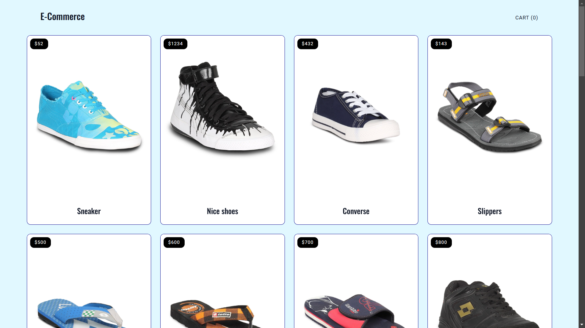
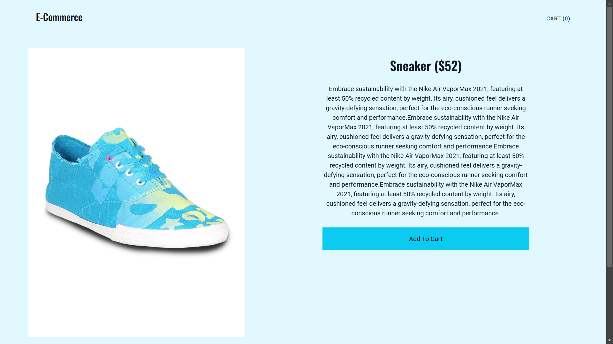
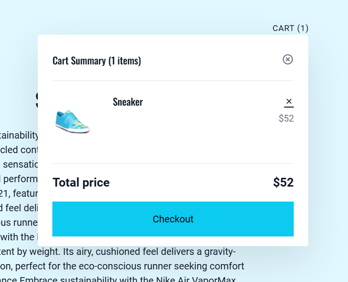

# Sneaker Store Web Application

A Flask-based web application to browse sneakers, view product details, add items to a cart, and place orders.

---

## Features

- **Sneaker Listing:** Browse a wide range of sneakers with images and pricing.
- **Product Page:** Detailed product view for each sneaker, including images, descriptions, and price.
- **Shopping Cart:** Add sneakers to your cart, update quantities, and remove items as needed.
- **Order Placement:** Seamless checkout process to place orders for your selected items.

---

## Tech Stack

- **Backend:** Flask (Python)
- **Frontend:** HTML, CSS, and JavaScript

---

## Screenshots

### 1. Home Page
The home page displays a list of sneakers with their images, names, and prices.



### 2. Product Page
A detailed view of a selected sneaker, showing its image, description, and purchase options.



### 3. Shopping Cart
A cart interface to manage selected items, update quantities, and review the total price.



---

## Installation and Setup

1. Clone the repository:
   ```bash
   git clone https://github.com/harshit-asu/ecommerce-flask
   cd ecommerce-flask
   ```

2. Create a virtual environment and activate it:
   ```bash
   python3 -m venv venv
   source venv/bin/activate # On Windows: venv\Scripts\activate
   ```

3. Install the required dependencies:
   ```bash
   pip install -r requirements.txt
   ```

4. Run the application:
   ```bash
   flask run
   ```

5. Open your browser and go to `http://127.0.0.1:5000`.

---

## Folder Structure

```
.
├── app.py            # Main application file
├── templates/        # HTML templates
├── static/           # CSS, JavaScript, and images
├── requirements.txt  # Python dependencies
└── README.md         # Project documentation
```

---

## Future Enhancements

- **User Authentication:** Enable users to sign up, log in, and manage their profiles.
- **Payment Integration:** Add payment gateway support for seamless transactions.
- **Product Search and Filter:** Implement a search and filter feature for better product discovery.

---

## Acknowledgments

- [Flask](https://flask.palletsprojects.com/) for the web framework.

---

Happy Coding!
